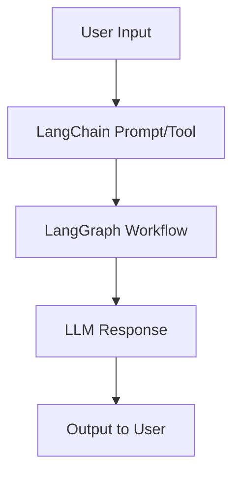

# 🤖 Agentic Chatbots with LangChain & LangGraph

_A collection of agent-powered chatbot workflows built using LangChain & LangGraph_


---

## 🌟 Overview

This repository is a **collection of agentic chatbot implementations** built using **LangChain** and **LangGraph**.

Each notebook demonstrates a **unique workflow** — from simple LLM chat to structured multi-step reasoning with tools, memory, and agents.

💡 _The repo is designed as a playground to learn, prototype, and showcase the power of agentic AI systems._

---

## 📂 Contents

Here are the included agentic workflows:

- 🗨️ **basic_chatbot.ipynb** – Minimal chatbot powered by LLM
- 📊 **bmi_calculator.ipynb** – AI agent that calculates BMI interactively
- 📝 **essayevaluation.ipynb** – Automated essay evaluator with scoring logic
- 😂 **joke_checkpointer.ipynb** – Humor generator with checkpointing workflow
- 🔗 **linkein_loop.ipynb** – Simulated LinkedIn assistant loop
- 💬 **llm_chat.ipynb** – General LLM-based conversational bot
- ⚡ **parallel.ipynb** – Example of running multiple agent tasks in parallel
- 🔗 **prompt_chaining.ipynb** – Sequential reasoning with chained prompts
- ➗ **quadratic_equation.ipynb** – Math problem solver (roots of quadratic equations)
- 🛒 **review_reply_workflow\.ipynb** – AI agent that replies to customer reviews

---

## 🏗️ Architecture

Each workflow is built using:

- **LangChain** → LLM orchestration
- **LangGraph** → Defining structured workflows (graphs, chains, loops)
- **LLMs** → Backend AI reasoning (plug in Gemini, OpenAI, etc.)
- **Optional Tools** → Math solver, text evaluator, custom logic



---

## 🛠️ Installation

```bash
# Clone repository
git clone https://github.com/yourusername/agentic-chatbots.git
cd agentic-chatbots

# Create environment
conda create -n agentic python=3.10 -y
conda activate agentic

# Install dependencies
pip install -r requirements.txt
```

---

## ▶️ Running a Notebook

1. Open the repo in **VS Code / Jupyter / Colab**
2. Start your environment and install missing libraries if prompted
3. Run any notebook, e.g.:

```bash
jupyter notebook basic_chatbot.ipynb
```

4. If the notebook requires an API key (Gemini / OpenAI), enter it when prompted

---

## 📈 Use Cases

- Building **AI tutors** (Essay Evaluator, Math Solver)
- Creating **customer experience agents** (Review Reply Bot)
- Exploring **creative AI** (Joke Generator, LinkedIn Loop)
- Testing **agent workflows** with checkpointing, chaining, and parallel tasks

---

## 📊 Future Roadmap

- 🔹 Add multi-document RAG-powered agents
- 🔹 Expand to **multi-agent collaboration workflows**
- 🔹 Integrate with **Streamlit UI** for real-time chat interfaces
- 🔹 Add Dockerized deployment for each workflow

---

## 👨‍💻 Author

**Adeel Hamid** – _AI | Data Science | MLOps | GenAI Engineer_

🔗 [LinkedIn](https://www.linkedin.com/in/adeelhamid)
🌐 [Portfolio & Contact](https://adeelhamid.github.com)
🎥 [YouTube](https://www.youtube.com/@adeelhamid)

---

✨ _If this repo helps you learn or build, don’t forget to ⭐ star it and share!_
